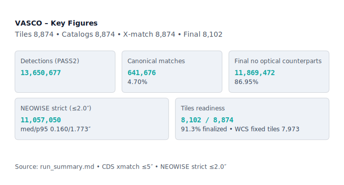
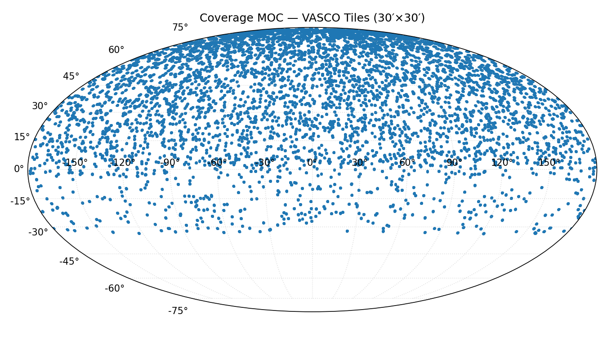

# VASCO: Reproducing the Image Processing Pipeline from MNRAS 515(1):1380

**This repository re‑implements the core data‑processing workflow described in “Discovering vanishing objects in POSS I red images using the Virtual Observatory” (Solano et al., MNRAS 2022).**

VASCO enables reproducible research on astronomical objects that have vanished from the sky, using digitised photographic plates and modern catalogues. The pipeline is designed for both astronomers and programmers interested in large-scale sky surveys and time-domain astronomy.

> **Article link:** https://academic.oup.com/mnras/article/515/1/1380/6607509

---

## Table of Contents

- [Project Overview](#project-overview)
- [Key Terms](#key-terms)
- [Key Figures](#key-figures)
- [Workflow Summary](#workflow-summary)
- [Quick Start](#quick-start)
- [Installation & Prerequisites](#installation--prerequisites)
- [Detailed Usage](#detailed-usage)
- [Docker Usage](#docker-usage)
- [Final Steps & Advanced Commands](#final-steps--advanced-commands)
- [Recent Improvements](#recent-improvements)
- [Troubleshooting](#troubleshooting)
- [Audit Findings & Technical Notes](#audit-findings--technical-notes)
- [Coverage Estimates](#coverage-estimates)
- [License & Contributions](#license--contributions)

---

## Project Overview

VASCO aims to reproduce and extend the methodology of a recent astronomical study that searched for objects which have disappeared from the sky over decades, using digitised photographic plates and modern catalogues. This repository provides a pipeline to process, cross-match, and analyse these data, making the research accessible and reproducible for both astronomers and interested programmers.

---

## Key Terms

- **Tile**: A small, square region of the sky processed as a unit.
- **Catalogue**: A list of detected astronomical sources with their properties.
- **Xmatch**: Cross-matching, i.e., associating detections with entries in external catalogues (Gaia, PS1).
- **Detection**: An object identified in an image tile.

---

## Key Figures



*The above graphic summarises the current status of my pipeline.*



*The above graphic shows the MOC plot of my tile coverage.*

---

## Workflow Summary

1. **Download** sky image tiles (POSS I red, POSSI-E enforced).
2. **Detect** sources in each tile using SExtractor (pass 1).
3. **Build** a point spread function (PSF) model with PSFEx.
4. **Re-detect** with PSF-aware SExtractor (pass 2).
5. **Cross-match** detections with external catalogues (Gaia, PS1) using CDS/VizieR.
6. **Filter** matched sources to ≤ 5″.
7. **Summarise** results and write per-tile run artefacts.

For a detailed workflow, see [WORKFLOW.md](WORKFLOW.md).


## Note on Duplicate Sources from Tile Overlap

Because tiles are selected at random and may overlap at their edges, it is possible for the same astronomical source to appear in multiple tiles. The pipeline performs deduplication **within each tile** (removing duplicate detections inside a single tile), but **does not remove duplicates across different tiles** by default.

As a result, the master Parquet dataset and any cross-tile summaries may contain multiple entries for the same source if it falls within overlapping regions of two or more tiles. This is expected behaviour for large-scale random tiling and does not affect most statistical analyses.

If a catalogue of unique sources (with all cross-tile duplicates removed) is required, a global deduplication step can be performed after merging, using a positional tolerance (e.g., 0.5 arcsec) across all tiles. This is not enabled by default, but can be added as a post-processing step if needed.

**Summary:**
- Deduplication is performed within each tile only.
- Cross-tile duplicates are not removed by default.
- Downstream analyses and summaries may slightly over-count sources in overlapping regions.
- Global deduplication can be added if a unique-source catalogue is required.


---

## Quick Start

1. **Set CDS tables** (host and/or container):
    ```bash
    export VASCO_CDS_GAIA_TABLE="I/350/gaiaedr3"
    export VASCO_CDS_PS1_TABLE="II/389/ps1_dr2"
    ```


2. **(Optional) Download some tiles**:
    ```bash
    python run-random.py download_loop --size-arcmin 30 --survey dss1-red --pixel-scale-arcsec 1.7
    ```

3. **Sweep steps**:
    ```bash
    python run-random.py steps --steps step4-xmatch,step5-filter-within5,step6-summarize \
      --workdir-root data/tiles --xmatch-backend cds --xmatch-radius 5.0
    ```

4. **Inspect per-tile outputs** (`xmatch/`, `RUN_*`) and logs (`xmatch/STEP4_CDS.log`, `logs/run_random.log`).

---

## Installation & Prerequisites

### Local (non-Docker) Runs

Ensure these tools are on your `PATH`:

- **Python** ≥ 3.10 (`pip`), with following libraries: `astropy`, `numpy`, `pandas`, `astroquery`, `scikit-learn`, `pyarrow`
- **SExtractor** (`sex` or `sextractor`)
- **PSFEx** (`psfex`)
- **STILTS** (`stilts`) — required for CDS cross-matching and CSV filtering

**Verify your setup:**
```bash
python -V
python -c "import astropy, numpy, pandas; print('OK')"
sex -v         # or: sextractor -v OR source-extractor -v
psfex -v
```

## Docker usage
Use the container image **`astro-tools:latest`** that bundles Python, SExtractor, PSFEx, STILTS, and system dependencies.

### Build the image
```bash
docker build -t astro-tools:latest .
```

### Run an interactive shell, then execute commands
> **Important:** export the CDS variables **inside** the container shell before running pipeline commands.

```bash
docker run -it --rm   -v "$PWD:/workspace"   -w /workspace   astro-tools:latest bash

# Inside the container:
export VASCO_CDS_GAIA_TABLE="I/350/gaiaedr3"
export VASCO_CDS_PS1_TABLE="II/389/ps1_dr2"

# Example — sweep steps 4, 5, and 6 over mounted data
python run-random.py steps   --steps step4-xmatch,step5-filter-within5,step6-summarize   --workdir-root data/tiles   --xmatch-backend cds   --xmatch-radius 5.0
```
## Detailed Usage

Please read [the workflow documentation](WORKFLOW.md)

### The main tool: `run-random.py`

`run-random.py` is the entry point for downloading tiles and sweeping steps across your tile tree under `data/tiles/`.

#### Subcommands

##### 1) `download_loop`
Continuously performs **Step 1** (download) at random sky positions until you interrupt it.

```bash
python run-random.py download_loop   --sleep-sec 15   --size-arcmin 30   --survey dss1-red   --pixel-scale-arcsec 1.7
```

**Options**
- `--sleep-sec` *(float, default 15)* time between downloads  
- `--size-arcmin` *(float, default 30)* tile width/height in arcminutes  
- `--survey` *(str, default `dss1-red`)*  
- `--pixel-scale-arcsec` *(float, default 1.7)* (alias: `--pixel-scale`)

##### 2) `steps`
Scans existing tile folders and runs the **requested steps only where outputs are missing**.

```bash
python run-random.py steps   --steps step4-xmatch,step5-filter-within5,step6-summarize   --workdir-root data/tiles   --size-arcmin 30   --xmatch-backend cds   --xmatch-radius 5.0   --cds-gaia-table "$VASCO_CDS_GAIA_TABLE"   --cds-ps1-table  "$VASCO_CDS_PS1_TABLE"
```

**Options**
- `--steps` *(required)*: any of  
  `step2-pass1, step3-psf-and-pass2, step4-xmatch, step5-filter-within5, step6-summarize`
- `--workdir-root` *(default `data/tiles`)*  
- `--limit` *(int, default 0)* stop after N step invocations  
- `--size-arcmin` *(float, default 30)*  
- **X‑match**  
  - `--xmatch-backend` *(choices `local|cds`, default `cds`)*  
  - `--xmatch-radius` *(float arcsec, default 5.0)*  
  - `--cds-gaia-table`, `--cds-ps1-table` *(fallback to env vars above)*  
- **Exports / QA (Step 6)**  
  - `--export` *(choices `none|csv|parquet|both`, default `csv`)*  
  - `--hist-col` *(default `FWHM_IMAGE`)*

**What it does**
- Runs a step **only when prerequisites exist and the step’s outputs are missing**.  
  Examples:
  - `step4-xmatch`: requires `pass2.ldac`, runs only if no `xmatch/sex_*_xmatch*.csv` exist yet.  
  - `step5-filter-within5`: requires `xmatch/*.csv`, runs only if no `*_within5arcsec.csv` exist yet.  
  - `step6-summarize`: requires `pass2.ldac`, runs only if `RUN_SUMMARY.md` is missing.
- **CDS path** writes:  
  - `xmatch/sex_gaia_xmatch_cdss.csv`  
  - `xmatch/sex_ps1_xmatch_cdss.csv` *(PS1 auto‑skipped for Dec < −30°; see `xmatch/STEP4_CDS.log`)*  
  - `xmatch/*_within5arcsec.csv`

##### 3) `download_from_tiles` *(optional helper)*
Re‑downloads **Step 1** for each existing tile folder (RA/Dec parsed from the folder name).

```bash
# Force re-download across all tiles (deletes raw FITS + header sidecars first)
python run-random.py download_from_tiles   --workdir-root data/tiles   --force   --size-arcmin 30 --survey dss1-red --pixel-scale-arcsec 1.7
```

**Options**
- `--workdir-root` *(default `data/tiles`)*  
- `--only-missing` *(default)* or `--no-only-missing`  
- `--force` *(delete raw FITS + sidecars, then re-download)*  
- `--size-arcmin`, `--survey`, `--pixel-scale-arcsec|--pixel-scale`  
- `--sleep-sec`, `--limit`

---

### Outputs (per tile folder)

`data/tiles/tile-RA<deg>-DEC<deg>/`

- **Raw**: `raw/<fits>.fits`, `raw/<fits>.fits.header.json` *(POSSI‑E only)*  
- **Detections**: `pass1.ldac`, `pass1.psf`, `pass2.ldac` (+ logs: `sex.out|err`, `psfex.out|err`)  
- **X‑match (CDS)**:  
  - `xmatch/sex_gaia_xmatch_cdss.csv`  
  - `xmatch/sex_ps1_xmatch_cdss.csv` *(may be absent when skipped)*  
  - `xmatch/*_within5arcsec.csv`  
  - `xmatch/STEP4_CDS.log` *(PS1 skip / errors / row counts)*
- **Run artifacts**:  
  - `RUN_INDEX.json` — tiles and key outputs  
  - `RUN_COUNTS.json` — `planned`, `downloaded`, `processed`, `filtered_non_poss`  
  - `RUN_OVERVIEW.md` — human‑readable overview (includes **Non‑POSS filtered** count)  
  - `RUN_SUMMARY.md` — exports + brief QA

---

## CDS backend (default; set these before running)

We follow the paper’s spirit by using **CDS/VizieR** instead of local catalog downloads.
Export these **on your host** and **inside the container**:

```bash
# Gaia EDR3 (CDS)
export VASCO_CDS_GAIA_TABLE="I/350/gaiaedr3"

# Pan-STARRS DR2 (CDS) – PS1 is auto-skipped for Dec < -30°
export VASCO_CDS_PS1_TABLE="II/389/ps1_dr2"
```


### Optional toggles:

```bash
# Disable PS1 entirely (affects both local and CDS backends)
export VASCO_DISABLE_PS1=1

# Disable USNO-B on the local backend (CDS path typically uses Gaia + PS1)
export VASCO_DISABLE_USNOB=1
```

---
## Troubleshooting

- **PS1 south of −30°** — not an error; PS1 has no coverage there. The runner skips PS1 automatically and logs it in `xmatch/STEP4_CDS.log`.
- **Non‑POSS tiles** — if a tile’s FITS header isn’t POSSI‑E, Step 1 discards it; the run counters record it as “Non‑POSS filtered”.
- **No CLI output when calling `python -m vasco.cli_pipeline` directly** — ensure you run from the repo root or set `PYTHONPATH="$PWD"`. The runner (`run-random.py`) sets this automatically for its subprocesses.

if Vizier CDS is busy and starts to time-out etc. try with these:

```bash
export VASCO_CDS_MODE=chunked
export VASCO_CDS_CHUNK_ROWS=500   # or 300 if still noisy
export VASCO_CDS_BLOCKSIZE=omit   # or =500 to align with chunks
export VASCO_CDS_MAX_RETRIES=2
export VASCO_CDS_BASE_BACKOFF=2.0
export VASCO_CDS_INTER_CHUNK_DELAY=1.0
export VASCO_CDS_JITTER=1.0
export VASCO_CDS_PRECALL_SLEEP=1
```
### About partial xmatch coverage

Partial xmatch coverage is expected near survey edges and does not indicate a pipeline error. This can happen with either PS1 or Gaia CDS. If any of the tile coordinates are outside PS1 AND Gaia coverage, the tile will be ignored downstream. If the coordinates are within PS1 or Gaia, but not both, the tile will be included in downstream. The effect on the science results is in any case negligible, especially after NeoWISE filtering.

### Cleaning Up Non-POSS-I and Empty Tile Folders

Over time, the tile data folder (`./data/tiles/`) may accumulate legacy or empty tile directories, especially from earlier runs before strict POSSI-E enforcement. These folders can slow down backfill and aggregation scripts.

To safely remove non-POSS-I tiles (e.g., SERC survey) and empty tile folders, use the provided cleaner script:

```bash
# Dry-run: see what would be deleted (no changes made)
python scripts/cleanup_non_possi_tiles.py --mode all --verbose

# Actually delete flagged folders (permanent)
python scripts/cleanup_non_possi_tiles.py --mode all --apply
```
---
### Docker kills your script

Docker might terminate your script without much warnings or other messages than "Killed". Usually that means the script is using too much memory. Docker has a default memory limit of 4-8GB. Increase it to 16. You might want to consider increasing the CPU, swap size and disk usage limits, too.

### SExtractor diagnostic files

Soure extractor may leave some undocumented diagnostic files on your disk depending on the sw version and environment. These files are not needed by the pipeline. They use a lot of diskspace, and can be safely deleted.

I made a small bash script ``clean_checkimages.sh`` which you can find under the scripts folder. 
The script performs a search for the following filenames: ``resi_pass1.fits``, ``chi_pass1.fits`` and ``samp_pass1.fits`` under ./data/tiles. As a precaution, it doesn't delete the files, but it tells you how to do that. I didn't want to delete them automatically, because I cannot be sure if these files are created in every instance of the pipeline (local or dockerized).

Note that these files will be always created during pipeline step 2 (during SExtractor pass 2). I couldn't figure out why the files are created, but apparently source-extractor needs them. There's absolutely no documentation about this behavior. You will not find these filenames via Google search for example. 

## Final Steps & Advanced Commands

After all steps have completed for all tiles, copy vanish_neowise_nnnn.csv via http://svocats.cab.inta-csic.es/vanish-neowise/index.php?action=search to data/vasco-svo/ folder.

Run this script 
```bash
run_vasco_neowise_compare.sh
```

The bash script executes these commands:
```bash
python ./scripts/fit_plate_solution.py --tiles-folder ./data/tiles
python ./scripts/filter_unmatched_all.py --data-dir ./data
python ./scripts/summarize_runs.py --data-dir data
python ./scripts/merge_tile_catalogs.py --tiles-root ./data/tiles --tolerance-arcsec 0.5     --publish-parquet --overwrite

# Optional: compare vasco dataset against optical (parquet) 
python scripts/compare_vasco_vs_optical.py --vasco data/vasco-cats/vanish_neowise_1765546031.csv \
  --radius-arcsec 2.0 --bin-deg 5 --chunk-size 20000 --out-dir data/local-cats/out/v3_match
```
If everything went OK, you should find vasco_matched_to_optical.csv and vasco_still_ir_only.csv in the data folder.

---
## Audit findings & Technical Notes
<details>
<summary>Update 18-Dec-2025</summary>

## Software update based on internal audit
We performed an internal audit to sanity‑check the current software run and ensure our pipeline faithfully reproduces the MNRAS 2022 methodology. The primary goals were to (1) verify that our matching and reporting weren’t obscuring true coverage, and (2) confirm the astrometric accuracy needed for the “no Gaia & no PS1 within 5″” criterion documented in our workflow

### Findings
- Metrics interpretation: The “matched %” lines in summaries were pair‑count densities (joins), not per‑detection coverage. This can exceed 100% and mislead downstream readers
- Astrometry drift on photographic plates (DSS1/POSS‑I): Many tiles showed median residuals ~0.5–1.0″ and P90 ~1.2–1.8″, typical when relying only on catalogue WCS and non‑windowed centroids
- Outcome after fixes: After switching to windowed centroids and adding a per‑tile Gaia‑tied plate solution, warnings dropped dramatically (only a small handful remain, mostly low‑match tiles)

### How it was fixed
A post‑pipeline Step 0 script that fits a per‑tile polynomial plate solution to Gaia matches, then writes corrected coordinates into each tile’s final_catalog_wcsfix.csv. Downstream scripts now prefer these corrected columns if present:
- Post‑0: fit plate solution → writes final_catalog_wcsfix.csv (columns: RA_corr, Dec_corr)
- Post‑1: unmatched & final → automatically uses corrected RA/Dec where available (filter_unmatched_all.py)
- Post‑2: run summaries → now also reports tiles_with_wcsfix (summarize_runs.py)
- Post‑3: merge catalogs → prefers corrected RA/Dec when present (merge_tile_catalogs.py)

### what do you need to do
Update to the latest version, rebuild docker and keep running. More reading [in the workflow doc](WORKFLOW.md)

### what to expect next
NeoWISE filtering will be implemented when time permits. NeoWISE will filter out vast majority of sources so I won't implement it before more data has went through the pipeline and analysis.

</details>

## Recent Improvements

### Gaia xmatch column names

Some post-processing scripts expect Gaia cross-match columns to be named `RA_ICRS`/`DE_ICRS`, `RAJ2000`/`DEJ2000`, or `RA`/`DEC`. If you encounter warnings about missing RA/Dec columns, check if your CSVs use lowercase `ra`/`dec` and update the script to recognise these as well. Support for lower-case ra/dec was added to `fit_plate_solution.py` script.

### Pipeline Hardening and Data Integrity Improvements

Recent updates have made the VASCO pipeline more robust, reliable, and easier to maintain. These changes improve data quality, reduce the risk of partial or invalid files, and make troubleshooting and maintenance more straightforward.

#### Key Improvements

- **Transactional Downloads:**  
  FITS files are now downloaded to a temporary location and only moved to their final destination if they pass strict FITS and WCS sanity checks. This prevents incomplete or invalid files from appearing in the data tree.

- **POSSI-E Enforcement:**  
  The pipeline strictly enforces that only POSSI-E plates are accepted for processing. Any non-POSS plates are immediately rejected and logged with a clear reason.

- **Normalised Filenames:**  
  RA values are wrapped to [0, 360) and Dec values are clamped to [-90, +90]. Filenames use three decimal places for RA/Dec, matching the tile ID granularity and ensuring consistency across runs.

- **Sanitised Cross-match Inputs:**  
  Before cross-matching with CDS (Gaia/PS1), the SExtractor CSV is sanitised so that all RA/Dec values are within valid bounds. This prevents errors such as “RA < 0 or > 360!” during STILTS processing.

- **Standardised Logging:**  
  All failure reasons are now tagged with clear, greppable tokens (e.g., `REJECT_NON_FITS`, `REJECT_NON_WCS`, `SKIP_PS1_DEC_LT_-30`). This makes it much easier to audit and maintain the pipeline.

- **Cleaner Data Tree:**  
  The improvements above, along with periodic use of the `cleanup_non_possi_tiles.py` script, ensure that only valid, processable tiles remain in the data folder. This speeds up backfills and downstream analysis.

#### What This Means for Users

- The pipeline is now more resilient to edge cases and external service quirks.
- Downstream scripts and aggregation tools will benefit from cleaner, more consistent input data.
- Maintenance and troubleshooting are easier, thanks to improved logging and file naming.
- No changes are required for downstream scripts or analysis workflows.

For more details on the cleaner script and how to maintain your data tree, see the [Cleaning Up Non-POSS-I and Empty Tile Folders](#cleaning-up-non-poss-i-and-empty-tile-folders) section.


## Coverage estimates 

Estimates with 30′×30′ tiles (POSS‑I ~ Dec ≥ −30°)

**Assumptions**
- Full sky area: ~41,253 deg²
- POSS‑I/PS1‑like coverage (Dec ≥ −30°): fraction = (1 − sin(−30°)) / 2 = **0.75** → area ≈ **30,940 deg²**
- Tile size: **30′×30′** ⇒ **0.5°×0.5°** ⇒ area **0.25 deg²** per tile

**Estimated tile counts**
- **Full POSS‑I coverage (≈ 75% of sky)**: ~**123,759 tiles**
- **Statistical subsample 50%**: ~**61,879 tiles**
- **Statistical subsample 20%**: ~**24,752 tiles**
- **Statistical subsample 10%**: ~**12,376 tiles**

> Rule‑of‑thumb: with POSSI‑E enforcement and occasional STScI gaps, budget a **5–10% overhead** in attempted downloads.
> Example: for a 20% subsample (~24,752 tiles), attempt **~25,989–27,227 downloads**.

---
## License & contributions

See `LICENSE` (if present). PRs/issues are welcome for reliability, data provenance, and reproducibility improvements.
