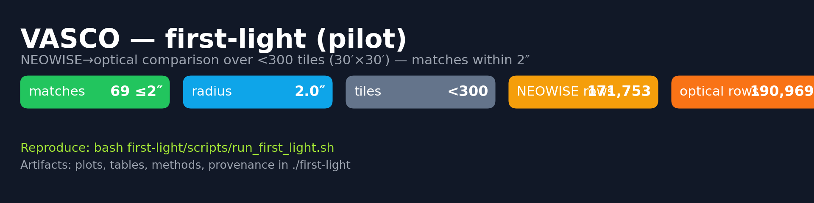

# VASCO (v0.07.1) — PSF‑aware pipeline re‑production of MNRAS 515(1):1380

<p align="center">
  
</p>

**important note on Vizier CDS time-outs**
Before running, execute: `source scripts/.env.cds-fast.sh` for good env values
if Vizier CDS is busy and starts to time-out etc. try with these:

```bash
export VASCO_CDS_MODE=chunked
export VASCO_CDS_CHUNK_ROWS=500   # or 300 if still noisy
export VASCO_CDS_BLOCKSIZE=omit   # or =500 to align with chunks
export VASCO_CDS_MAX_RETRIES=2
export VASCO_CDS_BASE_BACKOFF=2.0
export VASCO_CDS_INTER_CHUNK_DELAY=1.0
export VASCO_CDS_JITTER=1.0
export VASCO_CDS_PRECALL_SLEEP=1
```

This repository re‑implements the core data‑processing workflow described in 
**“Vanishing & Appearing Sources during a Century of Observations”** (MNRAS 515(1):1380, 2022).
Paper: https://academic.oup.com/mnras/article/515/1/1380/6607509

The pipeline:

---

## Prerequisites (local runs)

For **local** (non‑Docker) runs, install and ensure these tools are on your `PATH`:

- **Python** ≥ 3.10 (with `pip`) and scientific libs: `astropy`, `numpy`, `pandas`
- **SExtractor** (binary `sex` or `sextractor`)
- **PSFEx** (binary `psfex`)
- **STILTS** (binary `stilts`) — required for CDS cross‑matching and CSV filtering

**Verify** your setup:
```bash
python -V
python -c "import astropy, numpy, pandas; print('OK')"
sex -v   # or: sextractor -v
psfex -v
stilts -version
```

**Install tips**
- **Debian/Ubuntu** (example; versions may vary):
  ```bash
  sudo apt-get update && sudo apt-get install -y sextractor psfex default-jre
  # STILTS: download the latest tarball from http://www.starlink.ac.uk/stilts/ and place `stilts` on PATH
  ```
- **macOS** (Homebrew):
  ```bash
  brew install sextractor psfex openjdk
  # STILTS: download app/tarball from the STILTS site; add `stilts` to PATH
  ```

> If you run inside **Docker**, these tools are bundled in the image; see the Docker section below.


1. **Download** a DSS1‑red tile (POSSI‑E only; see below) and save the FITS + a JSON **header sidecar**.
2. **Detect** sources using **SExtractor** (pass 1), then build a **PSFEx** model.
3. **Re‑detect** with a PSF‑aware SExtractor (pass 2).
4. **Cross‑match** detections to **Gaia** + **PS1** using **CDS** (VizieR) services by default.
   *PS1 is automatically skipped south of −30° declination; the decision is logged.*
5. **Filter** matched sources to **≤ 5″**.
6. **Summarize** results and write per‑tile run artifacts.

---

## CDS backend (default; set these before running)

We follow the paper’s spirit by using **CDS/VizieR** instead of local catalog downloads.
Export these **on your host** and **inside the container**:

```bash
# Gaia EDR3 (CDS)
export VASCO_CDS_GAIA_TABLE="I/350/gaiaedr3"

# Pan-STARRS DR2 (CDS) – PS1 is auto-skipped for Dec < -30°
export VASCO_CDS_PS1_TABLE="II/389/ps1_dr2"
```

Optional toggles:

```bash
# Disable PS1 entirely (affects both local and CDS backends)
export VASCO_DISABLE_PS1=1

# Disable USNO-B on the local backend (CDS path typically uses Gaia + PS1)
export VASCO_DISABLE_USNOB=1
```

---

## POSSI‑E enforcement (Step 1)

After each download, the FITS header is read and the tile is **kept only if** `SURVEY == "POSSI-E"`.
*Non‑POSS plates are discarded and logged.* For retained tiles we write:
`raw/<fits>.fits.header.json` containing selected header keys (plate id, WCS, dates) **plus** a full header dump.

---

## The main tool: `run-random.py`

`run-random.py` is the entry point for downloading tiles and sweeping steps across your tile tree under `data/tiles/`.

### Subcommands

#### 1) `download_loop`
Continuously performs **Step 1** (download) at random sky positions until you interrupt it.

```bash
python run-random.py download_loop   --sleep-sec 15   --size-arcmin 30   --survey dss1-red   --pixel-scale-arcsec 1.7
```

**Options**
- `--sleep-sec` *(float, default 15)* time between downloads  
- `--size-arcmin` *(float, default 30)* tile width/height in arcminutes  
- `--survey` *(str, default `dss1-red`)*  
- `--pixel-scale-arcsec` *(float, default 1.7)* (alias: `--pixel-scale`)

#### 2) `steps`
Scans existing tile folders and runs the **requested steps only where outputs are missing**.

```bash
python run-random.py steps   --steps step4-xmatch,step5-filter-within5,step6-summarize   --workdir-root data/tiles   --size-arcmin 30   --xmatch-backend cds   --xmatch-radius 5.0   --cds-gaia-table "$VASCO_CDS_GAIA_TABLE"   --cds-ps1-table  "$VASCO_CDS_PS1_TABLE"
```

**Options**
- `--steps` *(required)*: any of  
  `step2-pass1, step3-psf-and-pass2, step4-xmatch, step5-filter-within5, step6-summarize`
- `--workdir-root` *(default `data/tiles`)*  
- `--limit` *(int, default 0)* stop after N step invocations  
- `--size-arcmin` *(float, default 30)*  
- **X‑match**  
  - `--xmatch-backend` *(choices `local|cds`, default `cds`)*  
  - `--xmatch-radius` *(float arcsec, default 5.0)*  
  - `--cds-gaia-table`, `--cds-ps1-table` *(fallback to env vars above)*  
- **Exports / QA (Step 6)**  
  - `--export` *(choices `none|csv|parquet|both`, default `csv`)*  
  - `--hist-col` *(default `FWHM_IMAGE`)*

**What it does**
- Runs a step **only when prerequisites exist and the step’s outputs are missing**.  
  Examples:
  - `step4-xmatch`: requires `pass2.ldac`, runs only if no `xmatch/sex_*_xmatch*.csv` exist yet.  
  - `step5-filter-within5`: requires `xmatch/*.csv`, runs only if no `*_within5arcsec.csv` exist yet.  
  - `step6-summarize`: requires `pass2.ldac`, runs only if `RUN_SUMMARY.md` is missing.
- **CDS path** writes:  
  - `xmatch/sex_gaia_xmatch_cdss.csv`  
  - `xmatch/sex_ps1_xmatch_cdss.csv` *(PS1 auto‑skipped for Dec < −30°; see `xmatch/STEP4_CDS.log`)*  
  - `xmatch/*_within5arcsec.csv`

#### 3) `download_from_tiles` *(optional helper)*
Re‑downloads **Step 1** for each existing tile folder (RA/Dec parsed from the folder name).

```bash
# Force re-download across all tiles (deletes raw FITS + header sidecars first)
python run-random.py download_from_tiles   --workdir-root data/tiles   --force   --size-arcmin 30 --survey dss1-red --pixel-scale-arcsec 1.7
```

**Options**
- `--workdir-root` *(default `data/tiles`)*  
- `--only-missing` *(default)* or `--no-only-missing`  
- `--force` *(delete raw FITS + sidecars, then re-download)*  
- `--size-arcmin`, `--survey`, `--pixel-scale-arcsec|--pixel-scale`  
- `--sleep-sec`, `--limit`

---

## Outputs (per tile folder)

`data/tiles/tile-RA<deg>-DEC<deg>/`

- **Raw**: `raw/<fits>.fits`, `raw/<fits>.fits.header.json` *(POSSI‑E only)*  
- **Detections**: `pass1.ldac`, `pass1.psf`, `pass2.ldac` (+ logs: `sex.out|err`, `psfex.out|err`)  
- **X‑match (CDS)**:  
  - `xmatch/sex_gaia_xmatch_cdss.csv`  
  - `xmatch/sex_ps1_xmatch_cdss.csv` *(may be absent when skipped)*  
  - `xmatch/*_within5arcsec.csv`  
  - `xmatch/STEP4_CDS.log` *(PS1 skip / errors / row counts)*
- **Run artifacts**:  
  - `RUN_INDEX.json` — tiles and key outputs  
  - `RUN_COUNTS.json` — `planned`, `downloaded`, `processed`, `filtered_non_poss`  
  - `RUN_OVERVIEW.md` — human‑readable overview (includes **Non‑POSS filtered** count)  
  - `RUN_SUMMARY.md` — exports + brief QA

---

## Docker — interactive (Option B)

Use the container image **`astro-tools:latest`** that bundles Python, SExtractor, PSFEx, STILTS, and system dependencies.

### Build the image
```bash
docker build -t astro-tools:latest .
```

### Run an interactive shell, then execute commands
> **Important:** export the CDS variables **inside** the container shell before running pipeline commands.

```bash
docker run -it --rm   -v "$PWD:/workspace"   -w /workspace   astro-tools:latest bash

# Inside the container:
export VASCO_CDS_GAIA_TABLE="I/350/gaiaedr3"
export VASCO_CDS_PS1_TABLE="II/389/ps1_dr2"

# Example — sweep steps 4, 5, and 6 over mounted data
python run-random.py steps   --steps step4-xmatch,step5-filter-within5,step6-summarize   --workdir-root data/tiles   --xmatch-backend cds   --xmatch-radius 5.0
```

---

## Quick start

1) **Set CDS tables** (host and/or container):
```bash
export VASCO_CDS_GAIA_TABLE="I/350/gaiaedr3"
export VASCO_CDS_PS1_TABLE="II/389/ps1_dr2"
```

2) **(Optional) Download some tiles**
```bash
python run-random.py download_loop --size-arcmin 30 --survey dss1-red --pixel-scale-arcsec 1.7
```

3) **Sweep steps**
```bash
python run-random.py steps   --steps step4-xmatch,step5-filter-within5,step6-summarize   --workdir-root data/tiles   --xmatch-backend cds   --xmatch-radius 5.0
```

4) **Inspect per‑tile outputs** (`xmatch/`, `RUN_*`) and logs (`xmatch/STEP4_CDS.log`, `logs/run_random.log`).

---

## Troubleshooting

- **PS1 south of −30°** — not an error; PS1 has no coverage there. The runner skips PS1 automatically and logs it in `xmatch/STEP4_CDS.log`.
- **Non‑POSS tiles** — if a tile’s FITS header isn’t POSSI‑E, Step 1 discards it; the run counters record it as “Non‑POSS filtered”.
- **No CLI output when calling `python -m vasco.cli_pipeline` directly** — ensure you run from the repo root or set `PYTHONPATH="$PWD"`. The runner (`run-random.py`) sets this automatically for its subprocesses.

---

## License & contributions

See `LICENSE` (if present). PRs/issues are welcome for reliability, data provenance, and reproducibility improvements.

## Coverage estimates with 30′×30′ tiles (POSS‑I ~ Dec ≥ −30°)

**Assumptions**
- Full sky area: ~41,253 deg²
- POSS‑I/PS1‑like coverage (Dec ≥ −30°): fraction = (1 − sin(−30°)) / 2 = **0.75** → area ≈ **30,940 deg²**
- Tile size: **30′×30′** ⇒ **0.5°×0.5°** ⇒ area **0.25 deg²** per tile

**Estimated tile counts**
- **Full POSS‑I coverage (≈ 75% of sky)**: ~**123,759 tiles**
- **Statistical subsample 50%**: ~**61,879 tiles**
- **Statistical subsample 20%**: ~**24,752 tiles**
- **Statistical subsample 10%**: ~**12,376 tiles**

> Rule‑of‑thumb: with POSSI‑E enforcement and occasional STScI gaps, budget a **5–10% overhead** in attempted downloads.
> Example: for a 20% subsample (~24,752 tiles), attempt **~25,989–27,227 downloads**.

---

## final steps afer all steps have completed for all tiles

Copy vanish_neowise_nnnn.csv via http://svocats.cab.inta-csic.es/vanish-neowise/index.php?action=search to data/vasco-svo/ folder. This is the list of vanishing objects seen in NEOWISE but not in the optical / infrared (171753 rows)

commands listed below are collected in a shell script: `run_vasco_neowise_compare.sh` which can utilize the following envs:

```bash
DATA_DIR=/path/to/data \
TILES_ROOT=/path/to/data/tiles \
VASCO_CSV=/path/to/data/vasco-svo/vanish_neowise_1765546031.csv \
OPTICAL_MASTER=/path/to/data/vasco-svo/_master_tile_catalog_pass2.csv \
OUT_DIR=/path/to/out
```
Individual commands:
```bash
python ./scripts/filter_unmatched_all.py --data-dir ./data --backend cds --tol-cdss 0.05

python ./scripts/summarize_runs.py --data-dir data

python ./scripts/merge_tile_catalogs.py --tiles-root ./data/tiles --tolerance-arcsec 0.5

python ./scripts/compare_vasco_vs_optical.py --vasco data/vasco-svo/vanish_neowise_1765546031.csv --optical-master data/vasco-svo/_master_tile_catalog_pass2.csv --out-dir data
```
If everything went ok, you should find vasco_matched_to_optical.csv and vasco_still_ir_only.csv in the data folder.   

## Command Reference

| Command | Purpose | Common Flags | Outputs / Notes |
|---|---|---|---|
| `python run-random.py download_loop` | Continuously run **Step 1** downloads at random positions (POSSI‑E enforced) | `--sleep-sec` (default 15), `--size-arcmin` (default 30), `--survey` (default `dss1-red`), `--pixel-scale-arcsec` (alias: `--pixel-scale`, default 1.7) | Keeps only POSSI‑E plates; writes `raw/<fits>.fits` + `raw/<fits>.fits.header.json`; activity in `logs/run_random.log`. |
| `python run-random.py steps` | Sweep existing tiles and run **requested steps** only where outputs are missing | `--steps` (required; any of `step2-pass1, step3-psf-and-pass2, step4-xmatch, step5-filter-within5, step6-summarize`), `--workdir-root` (default `data/tiles`), `--limit`, `--size-arcmin` | **CDS backend** (default): use `--xmatch-backend cds`, `--xmatch-radius`, `--cds-gaia-table`, `--cds-ps1-table`. Writes `xmatch/*.csv`, `*_within5arcsec.csv`, `RUN_*`. **Idempotent**: runs only if outputs are missing. PS1 is auto‑skipped south of −30°; see `xmatch/STEP4_CDS.log`. |
| `python run-random.py download_from_tiles` | Re‑download **Step 1** per existing tile folder (RA/Dec parsed from folder name) | `--workdir-root` (default `data/tiles`), `--force` (delete raw FITS + sidecars first), `--only-missing` / `--no-only-missing`, `--size-arcmin`, `--survey`, `--pixel-scale-arcsec`, `--sleep-sec`, `--limit` | Useful for refreshing tiles after enabling POSSI‑E guard; writes the same raw outputs as Step 1. |
| `docker run -it --rm -v "$PWD:/workspace" -w /workspace astro-tools:latest bash` | Start interactive container shell with repo mounted | (inside container) export `VASCO_CDS_GAIA_TABLE` and `VASCO_CDS_PS1_TABLE` | Run `python run-random.py steps …` inside the container; ensure CDS env vars are set **in the container** before commands. |

**Environment variables (recap):**

- `VASCO_CDS_GAIA_TABLE` — e.g., `I/350/gaiaedr3`
- `VASCO_CDS_PS1_TABLE` — e.g., `II/389/ps1_dr2`
- `VASCO_DISABLE_PS1=1` — optional: disable PS1 entirely
- `VASCO_DISABLE_USNOB=1` — optional: disable USNO‑B for local backend
